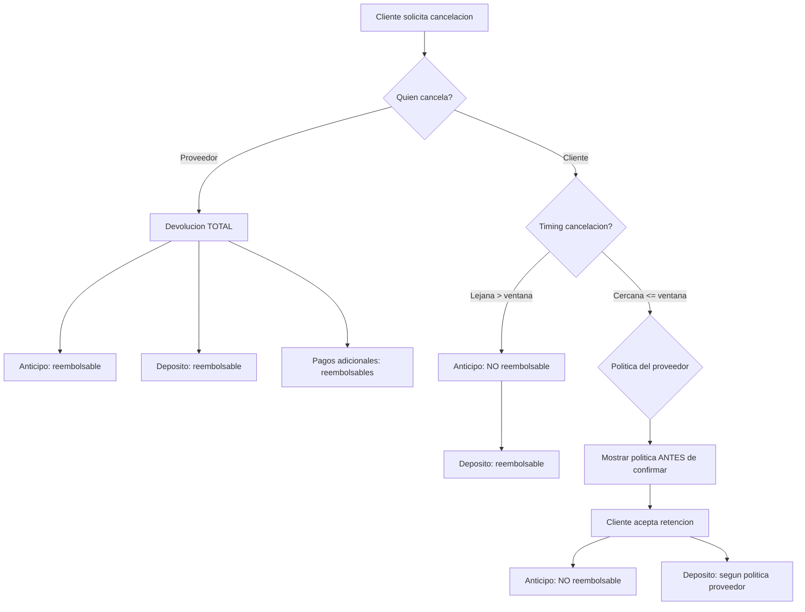

# Cancelaciones y Reembolsos

Las políticas de cancelación dependen de quién cancela (cliente o proveedor) y el momento relativo al evento. El anticipo del cliente **SHALL** ser no reembolsable. La plataforma **NO SHALL** mediar disputas comerciales.

→ Ver [→ pagos_y_comisiones.md](pagos_y_comisiones.md) para tipos de pago y orden de aplicación.
→ Ver [→ flujo_de_reserva.md](flujo_de_reserva.md) para estados de reserva.

## Cancelación por Cliente (Decisión 18)

Cuando un cliente cancela, el anticipo **SHALL** ser retenido por el proveedor (no reembolsable). Cerca del evento, la política configurada por el salón **SHALL** aplicar con aviso previo al pago completo.

### Escenarios por Timing

| Timing | Anticipo | Depósito | Nota |
|--------|----------|----------|------|
| Lejana (> ventana configurable) | NO reembolsable | Reembolsable | Cliente pierde anticipo |
| Cercana (≤ ventana configurable) | NO reembolsable | Según política del salón | Se muestra política ANTES de confirmar |

### Política Configurable por Proveedor

Cada proveedor **SHALL** configurar su propia política de cancelación:

| Parámetro | Descripción | Ejemplo |
|-----------|-------------|---------|
| % retención cercana | Porcentaje retenido por cancelación cercana | 50% |
| Ventana sin penalización | Días antes del evento para cancelar sin penalización extra | 30 días |
| Depósito reembolsable | Si el depósito se devuelve en cancelación cercana | Sí/No |

### Flujo de Cancelación del Cliente

**Caption**: Flujo de cancelación — diferencia entre cancelación por proveedor (devolución total) y por cliente (anticipo no reembolsable), con verificación de timing y política del proveedor (Diagrama D3).

### Supuesto 7 — Orden de Aplicación Anticipo → Depósito

> En caso de cancelación, el orden de aplicación de los pagos es: anticipo (no reembolsable) → depósito (reembolsable según política).

| Paso | Concepto | Acción |
|------|----------|--------|
| 1 | Anticipo | Se retiene (no reembolsable) |
| 2 | Depósito | Se evalúa según política del proveedor |
| 3 | Pagos adicionales | Se reembolsan |

## Cancelación por Proveedor — Devolución Total (Decisión 18)

Cuando un proveedor cancela una reserva, **SHALL** devolver TODO el monto pagado por el cliente. Esto incluye anticipo, depósito y cualquier pago adicional.

| Concepto | Devolución |
|----------|-----------|
| Anticipo | Sí — reembolsable |
| Depósito | Sí — reembolsable |
| Pagos adicionales | Sí — reembolsables |
| **Total** | **100% del monto pagado** |

> Ejemplo: Proveedor cancela reserva. Cliente pagó anticipo $3,000 + depósito $2,000 = $5,000. Sistema devuelve $5,000 completos al cliente.

El sistema **SHALL** procesar la devolución automáticamente y notificar al cliente.

→ Ver [→ flujo_de_reserva.md#estados-de-reserva--diagrama-completo-diagrama-d1](flujo_de_reserva.md#estados-de-reserva--diagrama-completo-diagrama-d1) para transición a estado "Cancelada".

## Política Configurable por Proveedor

Cada proveedor tiene autonomía para definir su política de cancelación dentro de los parámetros del sistema.

| Parámetro | Rango | Default sugerido |
|-----------|-------|------------------|
| % retención cancelación cercana | 0%–100% | 50% |
| Ventana sin penalización | 1–90 días | 30 días |
| Depósito reembolsable en cercana | Sí/No | Sí |

La política **SHALL** ser visible para el cliente antes de confirmar la reserva. Si el cliente cancela dentro de la ventana cercana, el sistema **SHALL** mostrar la política y requerir aceptación explícita antes de procesar.

## Sin Mediación de Disputas (Decisión 19)

La plataforma **NO SHALL** mediar disputas comerciales entre clientes y proveedores. Las disputas **SHALL** quedarse fuera de la app.

| Tipo de disputa | Quién resuelve | Acción del sistema |
|-----------------|----------------|-------------------|
| Comercial (servicio no entregado, calidad) | Entre las partes | Muestra mensaje: "Las disputas comerciales se resuelven entre las partes" + contacto del proveedor |
| Técnica (error de sistema, pago fallido) | Administrador | Redirige al admin (→ ver [→ roles_y_permisos.md#administrador](roles_y_permisos.md#administrador)) |

### Comportamiento en la Interfaz

- Si un cliente intenta abrir disputa comercial en la app, el sistema **SHALL** mostrar: *"Las disputas comerciales se resuelven entre las partes"*
- El sistema **SHALL** proporcionar información de contacto del proveedor
- El footer de la aplicación **SHALL** mostrar aviso claro de que la plataforma no media disputas

→ Ver [→ vision_y_alcance.md#out-of-scope-mvp](vision_y_alcance.md#out-of-scope-mvp) para confirmar que la mediación está fuera de alcance.

## Resumen de Escenarios

| # | Escenario | Quién cancela | Anticipo | Depósito | Nota |
|---|-----------|---------------|----------|----------|------|
| 1 | Cancelación lejana | Cliente | No reembolsable | Reembolsable | Cliente pierde anticipo |
| 2 | Cancelación cercana | Cliente | No reembolsable | Según política | Política visible antes de confirmar |
| 3 | Cancelación cercana (política 100%) | Cliente | No reembolsable | No reembolsable | Todo retenido |
| 4 | Proveedor cancela | Proveedor | Reembolsable | Reembolsable | Devolución total |
| 5 | Usuario elige no tramitar permiso de alcohol (opcional) → cancela | Cliente | No reembolsable | Según política | Aplica política proveedor |

→ Ver [→ flujo_de_reserva.md#permiso-de-alcohol—h-5](flujo_de_reserva.md#permiso-de-alcohol—h-5) para escenario de cancelación por permiso de alcohol no confirmado.

## Documentos Relacionados

| Documento | Relación |
|-----------|----------|
| `pagos_y_comisiones.md` | Tipos de pago y orden de aplicación |
| `flujo_de_reserva.md` | Estados de reserva → cancelación |
| `roles_y_permisos.md` | Administrador para disputas técnicas |
| `vision_y_alcance.md` | Mediación fuera de alcance MVP |
