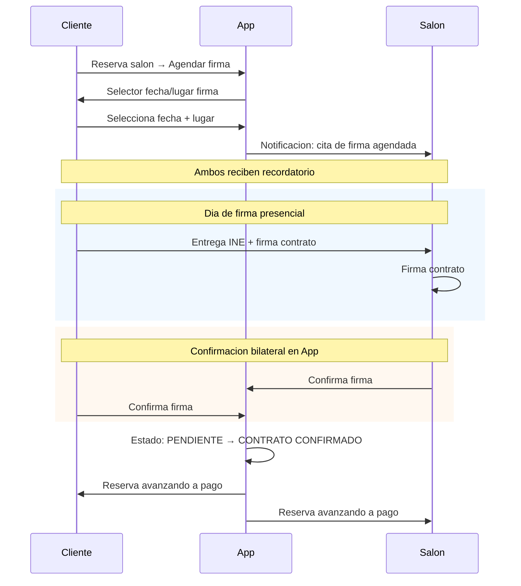
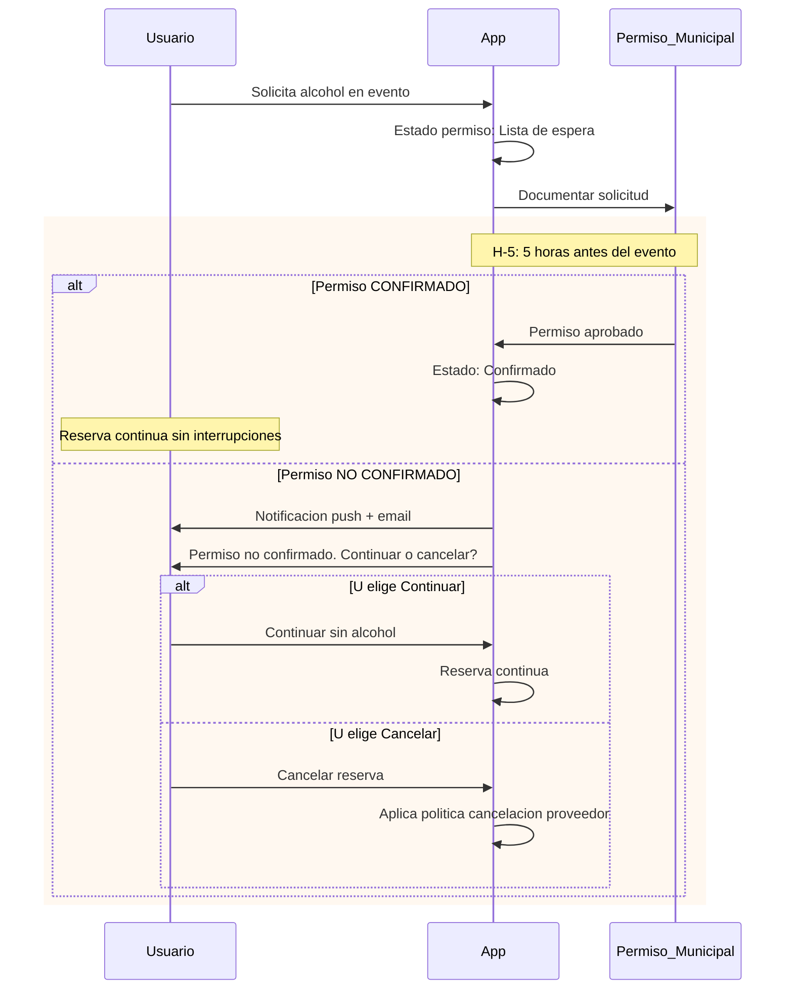
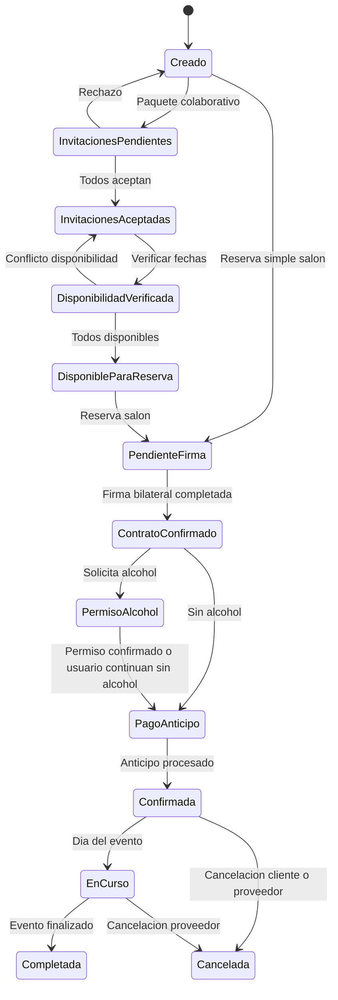

# Flujo de Reserva

El flujo de reserva cubre desde la selección de un servicio hasta la confirmación final, incluyendo contrato físico presencial, firma bilateral, permisos y estados intermedios. Reservas simples y de paquete siguen la misma infraestructura de estados.

→ Ver [→ paquetes_colaborativos.md](paquetes_colaborativos.md) para flujo de creación de paquetes colaborativos.
→ Ver [→ pagos_y_comisiones.md](pagos_y_comisiones.md) para procesamiento de pagos.

## Reserva Simple (Sin Paquete)

Una reserva simple sigue el flujo: selección de servicio → verificación de disponibilidad → selección de fecha/horario → selección de extras → resumen de precio → pago de anticipo → confirmación.

| Paso | Acción del cliente | Respuesta del sistema |
|------|-------------------|----------------------|
| 1 | Selecciona servicio | Verifica disponibilidad en tiempo real por slot (fecha + horario) |
| 2 | Elige fecha + horario (bloque de horas) | Muestra precio del bloque |
| 3 | Selecciona extras | Agrega al total |
| 4 | Revisa resumen | Desglose: bloque + hora extra + extras + impuestos + tarifa |
| 5 | Paga anticipo | Procesa vía Conekta (→ ver [→ pagos_y_comisiones.md#coneekta](pagos_y_comisiones.md#coneekta)) |
| 6 | Confirma reserva | Estado: CONFIRMADA |

### Reserva por Bloques de Horas (Decisión 3)

El cliente reserva un **bloque de horas** consecutivas. Si necesita más tiempo, puede agregar horas extra al momento de la reserva o durante el evento.

| Concepto | Descripción |
|----------|-------------|
| Bloque base | Horas incluidas en el precio fijo |
| Hora extra | Costo adicional por hora fuera del bloque |
| Total | Bloque + hora extra + extras + impuestos + tarifa |

> Ejemplo: Cliente reserva bloque de 4 horas ($8,000 MXN) + 2 horas extra ($5,000 MXN) + extra decoración ($1,500 MXN). Total: $14,500 MXN + impuestos + tarifa.

→ Ver [→ taxonomia_de_servicios.md#salón-de-eventos—bloque-de-horas](taxonomia_de_servicios.md#salón-de-eventos—bloque-de-horas) para modelo de precio de salón.

## Contrato Físico Presencial (Decisión 11)

El sistema **SHALL** requerir contrato físico para reservas de salón. El flujo completo es: agendar cita en app → firma presencial → doble confirmación en app → avance a pago.

### Supuesto 8

> El contrato físico es presencial. Ambas partes deben asistir, firmar y confirmar en la app. La reserva permanece PENDIENTE hasta que ambas partes confirmen la firma.

**Caption**: Flujo de contrato físico bilateral — firma presencial con doble confirmación en app (Diagrama D4).

### Estados del Contrato

| Estado | Descripción | Transición |
|--------|-------------|------------|
| Pendiente de firma | Cita agendada, esperando día de firma | → Firmando (día de firma) |
| Firmando | Ambas partes presentes, entregando INE | → Pendiente de confirmación |
| Pendiente de confirmación | Firma completada, esperando confirmación en app | → Contrato confirmado (ambos confirman) |
| Contrato confirmado | Ambas partes confirmaron la firma | → Avance a pago |

Si solo una parte confirma, la reserva **SHALL** permanecer en "Pendiente de confirmación". La parte que no confirmó **SHALL** recibir recordatorio.

→ Ver [→ cancelaciones_y_reembolsos.md](cancelaciones_y_reembolsos.md) para escenarios de cancelación después de firma.

## Permiso de Alcohol — Opcional con Notificación de Consecuencias (Supuesto 9)

Para el MVP se sigue la **normativa municipal de San Luis Río Colorado, Sonora, México** (→ ver [→ normativa_mexicana_2026.md#permisos-de-alcohol—normativa-municipal](normativa_mexicana_2026.md#permisos-de-alcohol—normativa-municipal)). El permiso de alcohol es **OPCIONAL**: la plataforma **SHALL** notificar **SIEMPRE** al usuario las **consecuencias de no tramitarlo** y la decisión final es del usuario — **NO** es cancelación automática. Si el usuario elige incluir alcohol y el permiso no se confirma a las 5 horas antes del evento (H-5), recibe notificación y debe decidir continuar o cancelar.

> **Supuesto 9**: El permiso de alcohol es opcional, con notificación obligatoria de consecuencias de no tramitarlo. Si no se confirma a H-5, el usuario notificado decide continuar o cancelar. Si cancela, aplica la política del proveedor. No es cancelación automática — es elección del usuario.

**Caption**: Timeline de decisión para permiso de alcohol — ventana H-5 con notificación y decisión del usuario (Diagrama D5).

### Decisiones del Usuario

| Opción | Resultado |
|--------|-----------|
| Tramitar permiso | Se documenta y confirma según el timeline H-5 |
| No tramitar permiso (opcional) | El sistema muestra las consecuencias de no tramitarlo; la reserva continúa sin servicio de alcohol |
| Continuar sin alcohol a H-5 | Reserva se mantiene, evento se realiza sin servicio de alcohol |
| Cancelar reserva | Aplica política de cancelación del proveedor (→ ver [→ cancelaciones_y_reembolsos.md](cancelaciones_y_reembolsos.md)) |

> **Consecuencias notificadas** al usuario por no tramitar el permiso: el evento **SHALL** realizarse sin servicio/venta de bebidas alcohólicas; si el proveedor o el evento exigen permiso para operar, la responsabilidad legal recae en el usuario/proveedor según la normativa municipal de SLRC, Sonora (→ ver [→ normativa_mexicana_2026.md#permisos-de-alcohol—normativa-municipal](normativa_mexicana_2026.md#permisos-de-alcohol—normativa-municipal)).

## Estados de Reserva — Diagrama Completo (Diagrama D1)

El sistema gestiona los siguientes estados para una reserva, desde creación hasta completado o cancelado.

**Caption**: Diagrama completo de estados de reserva — desde creación hasta completado o cancelado (Diagrama D1).

### Descripción de Estados

| Estado | Descripción | Transiciones posibles |
|--------|-------------|----------------------|
| Creado | Reserva iniciada | → Invitaciones pendientes (paquete), → Pendiente firma (simple) |
| Invitaciones pendientes | Paquete con invitaciones abiertas | → Invitaciones aceptadas, → Creado (rechazo) |
| Invitaciones aceptadas | Todos aceptaron | → Disponibilidad verificada |
| Disponibilidad verificada | Sistema verificó disponibilidad por slot (fecha + horario) | → Disponible para reserva, → Invitaciones aceptadas (conflicto) |
| Disponible para reserva | Listo para reserva | → Pendiente firma |
| Pendiente firma | Cita de firma agendada | → Contrato confirmado |
| Contrato confirmado | Firma bilateral completada | → Permiso alcohol, → Pago anticipo |
| Permiso alcohol | En lista de espera de permiso | → Pago anticipo (confirmado o usuario continúa) |
| Pago anticipo | Esperando pago | → Confirmada |
| Confirmada | Reserva confirmada con pago | → En curso, → Cancelada |
| En curso | Evento en progreso | → Completada, → Cancelada |
| Completada | Evento finalizado | Estado final |
| Cancelada | Reserva cancelada | Estado final |

## Flujo Completo de Extremo a Extremo

1. **Cliente selecciona servicio** → disponibilidad en tiempo real
2. **Selecciona fecha/horario** → bloque de horas + extras
3. **Resumen de precio** → desglose completo
4. **Contrato físico** (salón) → agendar cita → firma presencial → doble confirmación
5. **Permiso de alcohol** (opcional, si el usuario elige incluirlo) → notificación de consecuencias de no tramitarlo → decisión H-5
6. **Pago de anticipo** → procesamiento vía Conekta
7. **Confirmación** → ambas partes notificadas
8. **Evento** → en curso → completado

→ Ver [→ pagos_y_comisiones.md#cobro-flexible](pagos_y_comisiones.md#cobro-flexible) para opciones de cobro post-anticipo.

## Documentos Relacionados

| Documento | Relación |
|-----------|----------|
| `paquetes_colaborativos.md` | Creación de paquete → este flujo |
| `pagos_y_comisiones.md` | Reserva → pago anticipo/saldo |
| `cancelaciones_y_reembolsos.md` | Reserva → cancelación |
| `notificaciones.md` | Cada estado → notificación |
| `interfaces_cliente.md` | UI del cliente en el flujo |
| `interfaces_proveedor.md` | UI del proveedor en el flujo |
