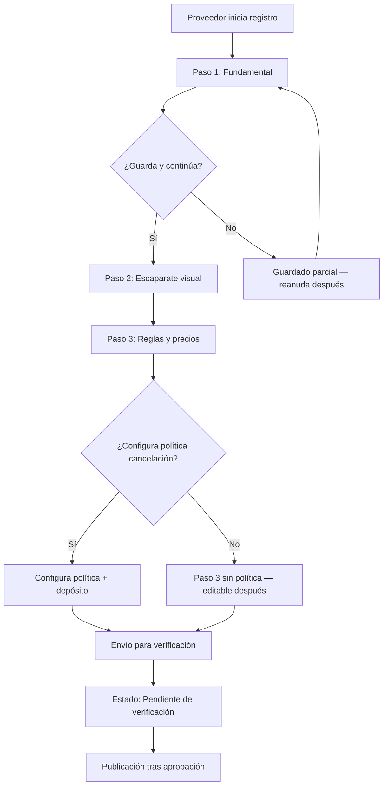

# Interfaces del Proveedor

Las pantallas del proveedor: onboarding wizard de 3 pasos, dashboard de 5 pestañas, agenda electrónica gratuita adaptable a cualquier giro, configuración y gestión de impuestos. El diseño parte de una arquitectura inspirada en Airbnb adaptada al sector de eventos.

→ Ver [→ flujo_de_reserva.md](flujo_de_reserva.md) para el flujo de reserva que estas interfaces gestionan.
→ Ver [→ taxonomia_de_servicios.md](taxonomia_de_servicios.md) para tipos de servicio y modelos de precio.

## Onboarding Wizard — 3 Pasos

El proveedor nuevo **SHALL** completar un wizard de alta de 3 pasos secuenciales. Cada paso solicita un conjunto de datos específico para no abrumar al usuario. El wizard **SHALL** guardar progreso y permitir continuar después de cerrar la app.

### Paso 1: Lo Fundamental

| Campo | Descripción | Obligatorio |
|-------|-------------|-------------|
| Definición del servicio | Tipo: Salón, Sonido, Servicio-persona | Sí |
| Ubicación | Fija para salones; área de servicio para proveedores móviles | Sí |
| Capacidad máxima | Personas que caben (salón) o eventos simultáneos (otros) | Sí |

### Paso 2: El Escaparate Visual

| Campo | Descripción | Obligatorio |
|-------|-------------|-------------|
| Fotografías | Mínimo 5 fotos de calidad profesional | Sí |
| Título del servicio | Nombre atractivo y descriptivo | Sí |
| Descripción detallada | Descripción completa del servicio ofrecido | Sí |
| Comodidades / Características | Etiquetas visuales: Wi-Fi, pista de baile, menú vegano, etc. | No |

### Paso 3: Reglas y Precios

| Campo | Descripción | Obligatorio |
|-------|-------------|-------------|
| Configuración de tarifas | Base, por hora, por bloque (→ ver [→ taxonomia_de_servicios.md#modelos-de-precio](taxonomia_de_servicios.md#modelos-de-precio)) | Sí |
| Políticas de reserva | Aprobación manual vs. Reserva inmediata | Sí |
| Bloqueo de fechas iniciales | Fechas no disponibles al momento del alta | No |
| Política de cancelación | Configuración de política (→ ver [→ cancelaciones_y_reembolsos.md](cancelaciones_y_reembolsos.md)) | Sí |
| Depósito de garantía | Monto retenido como garantía contra daños | No |

### Diagrama: Flujo de Onboarding (Diagrama D9)

**Caption**: Flujo de onboarding del proveedor — wizard de 3 pasos con guardado parcial y verificación (Diagrama D9).

### Comportamiento del Wizard

| Aspecto | Comportamiento |
|---------|---------------|
| Guardado automático | Cada paso se guarda automáticamente al avanzar |
| Reanudación | Al cerrar la app, el wizard reanuda desde el último paso completado |
| Validación | Cada paso valida campos obligatorios antes de avanzar |
| Retroceso | El proveedor **SHALL** poder volver a pasos anteriores para corregir |
| Publicación | El servicio queda "Pendiente de verificación" hasta aprobación del admin |

→ Ver [→ verificacion_de_identidad.md](verificacion_de_identidad.md) para verificación de identidad del proveedor.

## Dashboard — 5 Pestañas Core

Una vez activo, el proveedor gestiona su operación a través de **5 pestañas** principales. Cada pestaña **SHALL** mostrar información relevante y acciones rápidas contextualizadas.

### Tab 1: Hoy (Centro de Mando)

La pestaña "Hoy" es la primera pantalla que ve el proveedor al abrir la app. Concentra alertas de acción inmediata.

| Elemento | Contenido |
|----------|-----------|
| Alertas urgentes | Reservas pendientes de aprobación, mensajes sin leer |
| Resumen semanal | Eventos de la semana actual con fecha, cliente y monto |
| Recordatorios | "Tienes un evento mañana", "Saldo pendiente por cobrar" |
| Acciones rápidas | Aprobar/rechazar reserva, responder mensaje |

### Tab 2: Mensajes (Centro de Comunicación)

Inbox centralizado para comunicarse con clientes durante todo el flujo de reserva.

| Elemento | Contenido |
|----------|-----------|
| Lista de conversaciones | Ordenadas por último mensaje, con preview |
| Chat texto | Mensajes de texto en tiempo real |
| Notas de voz | Grabación y reproducción de notas de voz (→ ver [→ mensajeria.md](mensajeria.md)) |
| Respuestas rápidas | Mensajes predefinidos guardados (ej. "Confirmo disponibilidad", "Gracias por su interés") |
| Mensajes programados | Automatizaciones: mensaje de confirmación 24h antes del evento |

→ Ver [→ mensajeria.md](mensajeria.md) para funcionalidades completas de chat.

### Tab 3: Calendario (Gestión de Inventario, Precios y Ajuste Dinámico)

Vista visual de disponibilidad y ocupación con gestión de inventario en tiempo real. El ajuste dinámico de precios es una **feature del MVP**: el proveedor define tarifas diferenciadas por temporada, fin de semana o demanda, aplicadas sobre el precio base.

| Elemento | Contenido |
|----------|-----------|
| Vista mensual/semanal | Calendario visual con ocupación por día |
| **Ajuste dinámico de precios (feature MVP)** | Tarifas diferenciadas por temporada, fin de semana, o demanda, configurables por slot o período (→ ver [→ taxonomia_de_servicios.md#precios-dinámicos—capacidad-del-proveedor-supuesto-3](taxonomia_de_servicios.md#precios-dinámicos—capacidad-del-proveedor-supuesto-3)) |
| **Inventario por slot** | Cantidad máxima de eventos por fecha + horario (slot), con indicadores de cupo por slot (→ ver [→ taxonomia_de_servicios.md#concurrencia](taxonomia_de_servicios.md#concurrencia)) |
| Bloqueo de fechas | Crear eventos de mantenimiento o inoperación |
| Disponibilidad | Indicadores de capacidad: disponible / parcial / lleno, por slot (fecha + horario) |

> Ejemplo: Proveedor de sonido configura inventario de 3 eventos por slot y un ajuste dinámico de +15% para sábados en temporada alta. El calendario muestra cada slot con su cupo disponible y el precio vigente de la fecha.

### Tab 4: Anuncios (Gestión de Perfil/Catálogo)

Edición y gestión del perfil público del proveedor.

| Elemento | Contenido |
|----------|-----------|
| Edición de fotos | Agregar, eliminar, reordenar fotografías |
| Descripción | Editar título y descripción del servicio |
| Reglas | Configurar reglas y restricciones del servicio |
| Política de cancelación | Editar política configurable (→ ver [→ cancelaciones_y_reembolsos.md](cancelaciones_y_reembolsos.md)) |

### Tab 5: Estadísticas e Insights

Métricas de rendimiento y proyecciones financieras.

| Elemento | Contenido |
|----------|-----------|
| Historial de pagos | Pagos recibidos, pendientes, proyectados |
| Proyección de ganancias | Estimación de ingresos futuros por reservas confirmadas |
| Tasa de respuesta | Rapidez de contestación a mensajes (→ ver [→ roles_y_permisos.md#sistema-de-ranking](roles_y_permisos.md#sistema-de-ranking)) |
| Tasa de aceptación | Porcentaje de reservas aceptadas sobre solicitadas |
| Calificación promedio | Promedio de reviews de clientes |

## Adaptaciones para Eventos (vs. Alojamiento Tradicional)

A diferencia del modelo de alojamiento tradicional (Airbnb), los eventos requieren adaptaciones clave en la interfaz:

| Característica | Lógica Tradicional (Airbnb) | Adaptación para Eventos |
|---------------|----------------------------|------------------------|
| **Tiempo de reserva** | Por noches (check-in / check-out) | **Por horas / turnos**: bloques de 4, 6 u 8 horas, fraccionando un mismo día |
| **Geolocalización** | Ubicación fija (la propiedad no se mueve) | **Ubicación dinámica / radio de cobertura**: proveedores móviles definen zona de trabajo poligonal o radial |
| **Control de disponibilidad** | Binaria (1 casa = 1 reserva) | **Inventario por slot**: capacidad concurrente por fecha + horario — mobiliario o decoración puede cubrir 3–4 eventos en el mismo slot |
| **Flexibilidad de inventario** | Inventario fijo (renta completa) | **Extras / upselling**: agregar complementos desde la página del proveedor |

→ Ver [→ taxonomia_de_servicios.md#concurrencia](taxonomia_de_servicios.md#concurrencia) para configuración de capacidad concurrente.

## Agenda Electrónica Gratuita (Decisión 15 / 17)

La agenda electrónica **SHALL** ser **gratuita** para todos los proveedores, sin importar su giro. El sistema **SHALL** ser adaptable a cualquier tipo de servicio, no solo salones.

### Características de la Agenda

| Característica | Descripción |
|----------------|-------------|
| Gratuidad | Sin costo por usar la agenda electrónica |
| Adaptabilidad | Funciona para salones, sonidos, servicios-persona y cualquier giro futuro |
| Bloqueo de fechas | Crear eventos de mantenimiento o inoperación |
| Horarios rentables | Configurar qué horarios están disponibles para renta |
| Visibilidad al cliente | Los horarios configurados son visibles en la búsqueda del cliente (→ ver [→ interfaces_cliente.md#horarios-rentables-visibles](interfaces_cliente.md#horarios-rentables-visibles)) |

### Eventos de Mantenimiento e Inoperación

El proveedor **SHALL** poder registrar eventos que bloqueen disponibilidad:

| Tipo de Evento | Efecto en Agenda | Ejemplo |
|----------------|-----------------|---------|
| **Mantenimiento** | Fechas bloqueadas, aparece como "No disponible" | Reparación de equipo de sonido |
| **Inoperación** | Fechas bloqueadas temporalmente | Proveedor de vacaciones |
| **Evento privado** | Fecha reservada para uso propio | Boda familiar del proveedor |

> Ejemplo: Un proveedor de sonido crea un evento de mantenimiento para el 15 de marzo. Los clientes que busquen servicios para esa fecha no verán este proveedor en resultados.

### Selección de Horarios y Fechas para Rentar

El proveedor configura sus horarios disponibles de forma granular:

| Configuración | Opciones |
|---------------|----------|
| Días disponibles | Lunes a Domingo (seleccionables individualmente) |
| Horario por día | Apertura y cierre con bloques configurables |
| Bloques de horas | Duración del bloque base (4h, 6h, 8h) |
| Horas extra | Disponibilidad y precio de horas adicionales |
| Precio diferenciado | Tarifas por día de la semana o turno |

## Configuración General

### Concurrencia de Eventos Simultáneos — Inventario por Slot

El proveedor **SHALL** gestionar su capacidad mediante **inventario por slot** (fecha + horario): define la cantidad máxima de eventos que puede atender en el mismo slot. Salones están forzados a 1 evento por slot. La configuración **SHALL** realizarse desde el calendario (Tab 3), no solo en el alta del servicio.

| Tipo de Servicio | Concurrencia Default | Configurable |
|-----------------|---------------------|--------------|
| Salón de eventos | Forzada a **1** por slot | No — un salón = un evento por fecha y horario |
| Equipo de sonido | **2** por slot | Sí — hasta el máximo que configure por slot |
| Servicio-persona | **1** por slot | Sí — depende del personal disponible |

| Parámetro de inventario | Descripción |
|-------------------------|-------------|
| Límite por slot | Cantidad máxima de eventos simultáneos en el mismo fecha + horario |
| Indicador de cupo | Por slot: disponible / parcial / lleno, visible al proveedor y al cliente |
| Verificación de reserva | El sistema **SHALL** validar el cupo del slot (fecha + horario) al momento de reservar |

→ Ver [→ taxonomia_de_servicios.md#concurrencia](taxonomia_de_servicios.md#concurrencia) para detalles de concurrencia e inventario por slot.

### Política de Cancelación Configurable

El proveedor **SHALL** poder configurar su propia política de cancelación:

| Parámetro | Opciones |
|-----------|----------|
| Ventana de cancelación gratuita | 24h / 48h / 72h / 7 días antes del evento |
| Retención del anticipo | 0% / 25% / 50% / 100% dentro de la ventana |
| Depósito de garantía | Reembolsable siempre / No reembolsable en cancelación cliente |

> La política **SHALL** mostrarse al cliente **ANTES** de confirmar la reserva.

→ Ver [→ cancelaciones_y_reembolsos.md](cancelaciones_y_reembolsos.md) para escenarios completos de cancelación.

### Depósito de Garantía Configurable

El proveedor (específicamente salones) **SHALL** poder configurar el monto del depósito de garantía:

| Parámetro | Descripción |
|-----------|-------------|
| Monto | Cantidad en MXN retenida como garantía |
| Condiciones de devolución | Devuelto si no hay daños; retenido si hay incidentes |
| Visibilidad | El monto **SHALL** mostrarse al cliente antes de reservar |

→ Ver [→ pagos_y_comisiones.md#depósito-de-garantía](pagos_y_comisiones.md#depósito-de-garantía) para gestión del depósito.

## Gestión de Impuestos

### Calculadora de Impuestos

El proveedor **SHALL** contar con una calculadora de impuestos integrada:

| Función | Descripción |
|---------|-------------|
| Cálculo automático | Calcula impuestos aplicables según el tipo de servicio y ubicación |
| Simulación | Permite simular el impacto de impuestos antes de publicar precios |
| Desglose | Muestra desglose de impuestos en el resumen de reservas |

### Reporte Mensual

El proveedor **SHALL** recibir un reporte mensual de impuestos:

| Campo | Contenido |
|-------|-----------|
| Ingresos brutos | Total de ingresos antes de impuestos |
| Impuestos cobrados | Desglose por tipo de impuesto |
| Comisión de plataforma | Porcentaje cobrado por la app |
| Neto a recibir | Ingreso después de impuestos y comisión |
| CFDI fiscal | Documento fiscal descargable |

→ Ver [→ pagos_y_comisiones.md#impuestos—calculadora-y-reporte](pagos_y_comisiones.md#impuestos—calculadora-y-reporte) para detalles del cálculo de impuestos.

## Documentos Relacionados

| Documento | Relación |
|-----------|----------|
| `flujo_de_reserva.md` | UI gestiona el flujo de reserva |
| `taxonomia_de_servicios.md` | Tipos de servicio y configuración de precios |
| `cancelaciones_y_reembolsos.md` | Política de cancelación configurable |
| `pagos_y_comisiones.md` | Pagos, comisión e impuestos |
| `mensajeria.md` | Chat con clientes desde el dashboard |
| `interfaces_cliente.md` | Interfaz del cliente (contraparte) |
| `roles_y_permisos.md` | Rol Prestador y sus permisos |
