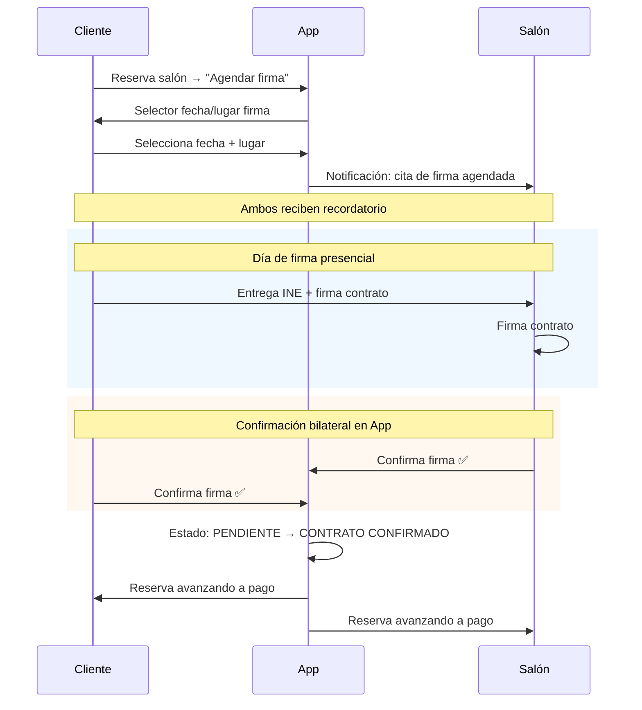
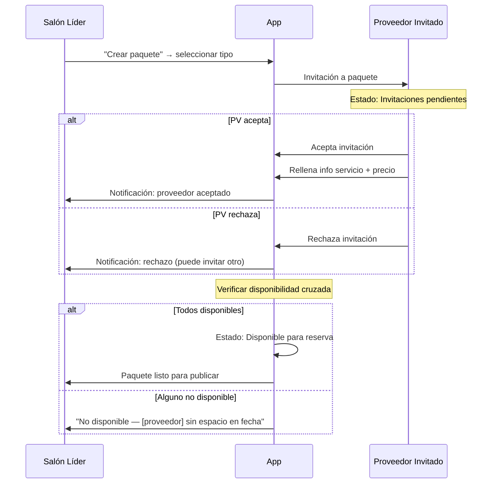
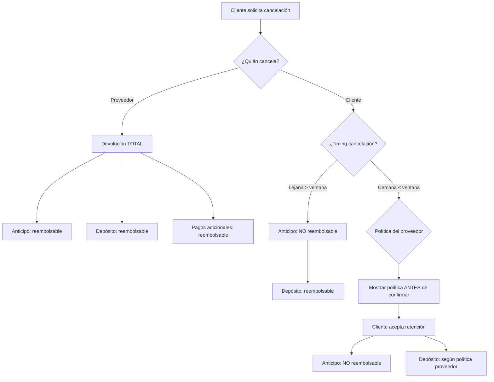
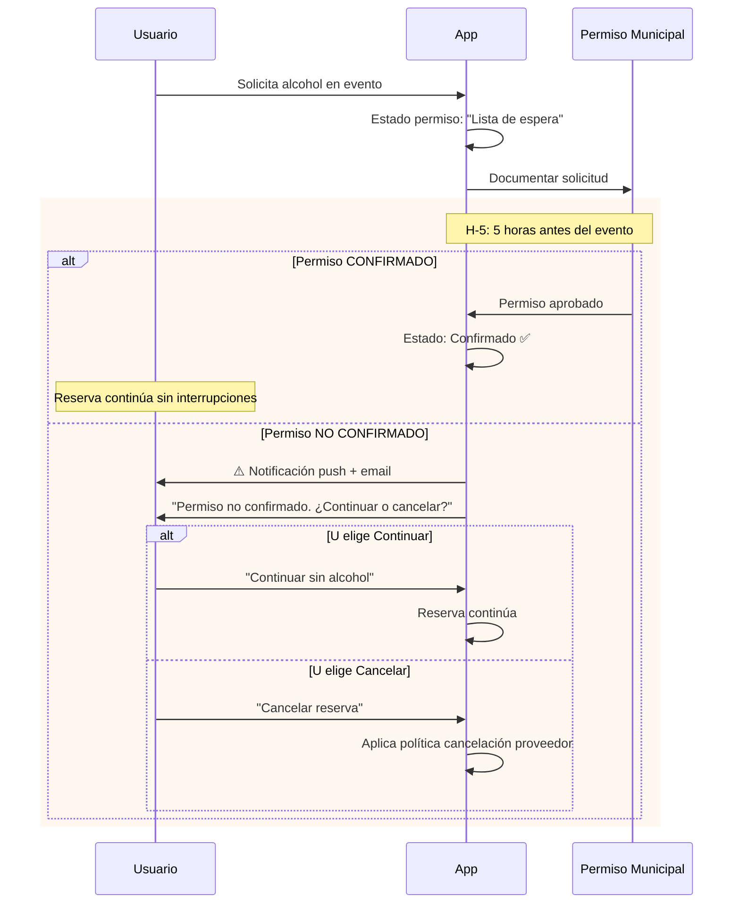
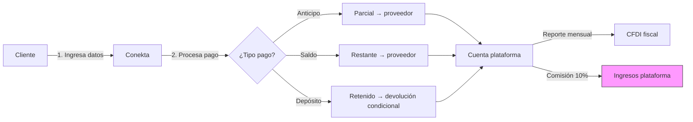
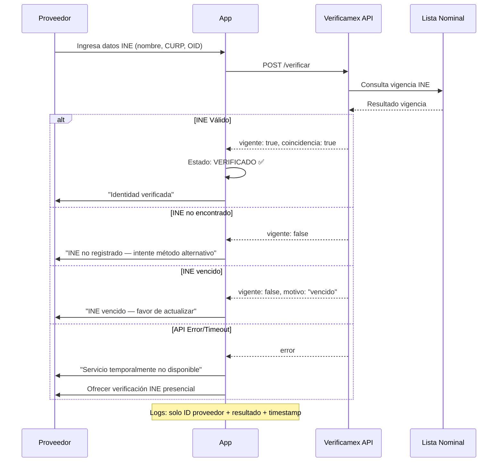
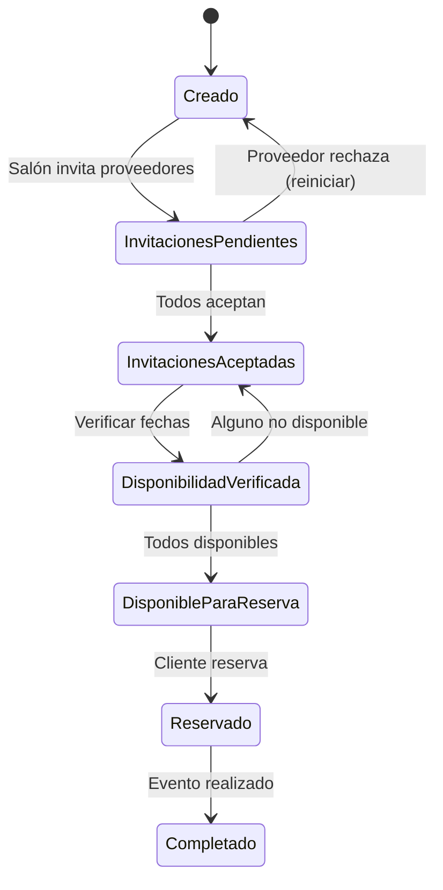

# Design: Documentación Completa de Producto — App Eventos

## Technical Approach

16 documentos estructurados en `snake_case` español + README índice maestro, escritos en `/home/anon/uni/web/`. Cada documento: autocontenido con cross-referencias, lead with answer, progressive disclosure, tablas/checklists sobre prosa. Diagramas mermaid para flujos complejos. Orden de creación: dependencias lineales (vision → roles → taxonomía → flujos → interfaces → soporte). Los 2 docs skeleton (`eventos.md`, `arquitectura_interfaz_proveedores_eventos.md`) se reemplazan; contenido válido de onboarding wizard y dashboard 5 tabs se migra a `interfaces_proveedor.md`.

## Architecture Decisions

### Decision: Estructura de Archivos — 16 documentos + README

| Aspecto | Elección | Alternativa | Justificación |
|---------|----------|-------------|---------------|
| Ubicación | Raíz de `/home/anon/uni/web/` | Subdirectorio `docs/` | Los docs son el producto; no hay código fuente que proteger |
| Convención | `snake_case` español | `kebab-case` inglés | Regla de proyecto: español neutro para artefactos |
| Contenido | Autocontenidos + cross-refs | Solo cross-refs (wiki-style) | Cada doc funciona standalone para revisión individual |
| README | Índice + glossario + tabla decisiones | Solo enlaces | Reduce tiempo de orientación a <30s (cognitive-doc-design) |

**Archivos finales** (orden de creación):

| # | Archivo | Capability | Líneas est. |
|---|---------|------------|-------------|
| 0 | `README.md` | Índice maestro, glossario, tabla decisiones 1-23 | 180-220 |
| 1 | `vision_y_alcance.md` | MVP, segmentos, modelo ingresos, alcance | 120-150 |
| 2 | `roles_y_permisos.md` | Roles, permisos, verificación, ranking, admin | 140-170 |
| 3 | `taxonomia_de_servicios.md` | Tipos servicio, modelos precios, concurrencia, extras | 130-160 |
| 4 | `paquetes_colaborativos.md` | Paquete completo, líder salón, invitación, disponibilidad | 140-170 |
| 5 | `flujo_de_reserva.md` | Bloques horas, contrato físico, firma, permisos, estados | 200-240 |
| 6 | `pagos_y_comisiones.md` | Conekta, comisión, tarifa app, impuestos, depósito, cobro | 170-200 |
| 7 | `cancelaciones_y_reembolsos.md` | Políticas por actor, tiempos, retención, devolución | 160-190 |
| 8 | `mensajeria.md` | Chat texto/voz/video, notas voz MVP, automatizaciones | 100-120 |
| 9 | `notificaciones.md` | 14+ tipos, triggers, canales | 130-160 |
| 10 | `verificacion_de_identidad.md` | INE presencial, KYC APIs, Verificamex, Lista Nominal | 120-150 |
| 11 | `interfaces_cliente.md` | Explorar, buscar, filtros, detalle, favoritos, rentas, perfil | 140-170 |
| 12 | `interfaces_proveedor.md` | Onboarding wizard, dashboard 5 tabs, agenda, config | 160-190 |
| 13 | `areas_de_simplificacion.md` | Trade-offs MVP, qué NO se hace | 110-140 |
| 14 | `normativa_mexicana_2026.md` | LFPDPPP, Ley Consumer, Código Comercio, permisos, SAT | 150-180 |
| 15 | `verificamex_integracion.md` | API Verificamex, Lista Nominal, flujo, errores, seguridad | 120-150 |
| **TOTAL** | | | **~2,370-2,910** |

**Orden de dependencias lineales** (crear en este orden):

```
0. README.md                    (índice — se actualiza al final)
1. vision_y_alcance.md          (base: qué es el producto)
2. roles_y_permisos.md          (depende de: vision)
3. taxonomia_de_servicios.md    (depende de: vision, roles)
4. paquetes_colaborativos.md    (depende de: vision, taxonomía, roles)
5. flujo_de_reserva.md          (depende de: taxonomía, paquetes, roles)
6. pagos_y_comisiones.md        (depende de: flujo, vision)
7. cancelaciones_y_reembolsos.md (depende de: pagos, flujo)
8. mensajeria.md                (depende de: roles, flujo)
9. notificaciones.md            (depende de: flujo, roles, mensajeria)
10. verificacion_de_identidad.md (depende de: roles, normativa)
11. interfaces_cliente.md        (depende de: flujo, taxonomía, pagos)
12. interfaces_proveedor.md      (depende de: flujo, taxonomía, roles)
13. areas_de_simplificacion.md   (depende de: todos los anteriores)
14. normativa_mexicana_2026.md   (standalone — referenciado por verificación, pagos)
15. verificamex_integracion.md   (depende de: verificación, normativa)
```

### Decision: Convención de Estilo

| Aspecto | Convención | Alternativa rechazada |
|---------|-----------|----------------------|
| Frontmatter | YAML mínimo: `estado`, `version`, `fecha`, `fuentes` | Sin frontmatter (menos trazabilidad) |
| Encabezados | `#` título → `##` secciones mayores → `###` subtemas | Headers más profundos (carga cognitiva) |
| Reglas | Keywords RFC 2119 en **negrita** (`**SHALL**`, `**MUST**`) | Solo mayúsculas (menos escaneable) |
| Glosario | Central en README, referenciado por nombre | Por documento (duplicación) |
| Listas | Checklists `- [ ]` para validación, bullets para features | Prosa para todo (densidad) |
| Tablas | Para comparativas, decisiones, estados, escenarios | Prosa paralela (menos escaneable) |
| Ejemplos | Bloques `> Ejemplo:` indentados | Solo referencia externa |

**Frontmatter estándar**:

```yaml
---
estado: completo | parcial
version: "1.0"
fecha: "2026-08-11"
fuentes:
  - openspec/changes/documentacion-producto-eventos/specs/{domain}/spec.md
  - arquitectura_interfaz_proveedores_eventos.md (migrado)
---
```

### Decision: Diagramas Mermaid — Cuáles y Dónde

| # | Diagrama | Tipo | Documento | Obligatorio |
|---|----------|------|-----------|-------------|
| D1 | Flujo de reserva completo con estados | `stateDiagram-v2` | `flujo_de_reserva.md` | Sí (spec pide estados) |
| D2 | Creación de paquete colaborativo con invitaciones | `sequenceDiagram` | `paquetes_colaborativos.md` | Sí (flujo complejo) |
| D3 | Cancelación × depósito (orden de aplicación) | `flowchart TD` | `cancelaciones_y_reembolsos.md` | Sí (edge cases) |
| D4 | Contrato físico bilateral (firma + doble confirmación) | `sequenceDiagram` | `flujo_de_reserva.md` | Sí (flujo más complejo) |
| D5 | Permiso alcohol H-5 (timeline de decisión) | `sequenceDiagram` | `flujo_de_reserva.md` | Sí (timeline crítico) |
| D6 | Arquitectura de pagos Conekta | `flowchart LR` | `pagos_y_comisiones.md` | Sí (flujo financiero) |
| D7 | Flujo de verificación Verificamex | `sequenceDiagram` | `verificamex_integracion.md` | Sí (integración API) |
| D8 | Estados del paquete colaborativo | `stateDiagram-v2` | `paquetes_colaborativos.md` | Sí (7 estados) |
| D9 | Flujo de onboarding proveedor | `flowchart TD` | `interfaces_proveedor.md` | No (wizard simple) |

**Reglas para mermaid**:
- Cada diagrama SHALL tener caption descriptivo
- Estados SHALL usar español neutro
- Transiciones SHALL incluir condición/guarda
- Diagramas >30 nodos se dividen en subdiagramas

### Decision: Sistema de Cross-References

**Formato estándar**: `[→ ver documento.md#sección](documento.md#sección)`

| Tipo | Formato | Ejemplo |
|------|---------|---------|
| Referencia a documento | `→ ver [pagos_y_comisiones.md#comisión](pagos_y_comisiones.md#comisión)` | En `flujo_de_reserva.md` al mencionar pago |
| Referencia a glossario | `→ glossario: [paquete colaborativo](README.md#glossario)` | En cualquier doc |
| Referencia circular | `→ ver también [cancelaciones_y_reembolsos.md](cancelaciones_y_reembolsos.md)` | En `pagos_y_comisiones.md` |
| Referencia a spec | `[Spec: requirements/flujo-de-reserva](openspec/changes/documentacion-producto-eventos/specs/flujo-de-reserva/spec.md)` | Solo en notas de pie |
| Tabla de relación | Sección `## Documentos Relacionados` al final de cada doc | Tabla con documento + relación |

**Tabla de relaciones documentos** (en README):

| Documento | Relacionado con | Relación |
|-----------|-----------------|----------|
| `vision_y_alcance.md` | `pagos_y_comisiones.md` | Modelo ingresos → comisión |
| `roles_y_permisos.md` | `verificacion_de_identidad.md` | Verificación es requisito de rol proveedor |
| `flujo_de_reserva.md` | `pagos_y_comisiones.md` | Reserva → pago anticipo/saldo |
| `flujo_de_reserva.md` | `cancelaciones_y_reembolsos.md` | Reserva → cancelación |
| `flujo_de_reserva.md` | `notificaciones.md` | Cada estado → notificación |
| `paquetes_colaborativos.md` | `flujo_de_reserva.md` | Paquete → reserva |
| `interfaces_cliente.md` | `flujo_de_reserva.md` | UI → flujo de reserva |
| `interfaces_proveedor.md` | `flujo_de_reserva.md` | UI → gestión de reservas |
| `verificacion_de_identidad.md` | `verificamex_integracion.md` | Método → integración API |
| `normativa_mexicana_2026.md` | `verificamex_integracion.md` | LFPDPPP → seguridad datos |

### Decision: Tabla Maestra de Decisiones 1-23

**Ubicación**: `README.md`, sección `## Tabla de Decisiones`.

**Formato de cada fila**:

| # | Decisión | Documento | Estado |
|---|----------|-----------|--------|
| 1 | MVP: particulares + empresas | `vision_y_alcance.md#mvp` | ✅ |
| 2 | Ingresos: comisión por transacción | `pagos_y_comisiones.md#comisión` | ✅ |
| 3 | Reserva por bloques de horas | `flujo_de_reserva.md#reserva-simple` | ✅ |
| 4 | Pagos: Conekta API MXN | `pagos_y_comisiones.md#coneekta` | ✅ |
| 5 | Reviews: solo post-pago + fecha pasada | `interfaces_cliente.md#historial` | ✅ |
| 6 | Paquetes: líder = salón | `paquetes_colaborativos.md#creación` | ✅ |
| 7 | Concurrencia: 1-for-salón, configurable otros | `taxonomia_de_servicios.md#concurrencia` | ✅ |
| 8 | 3 modelos de precios | `taxonomia_de_servicios.md#precios` | ✅ |
| 9 | Comisión sumada, visibilidad diferenciada | `pagos_y_comisiones.md#visibilidad` | ✅ |
| 10 | Depósito configurable por salón | `pagos_y_comisiones.md#depósito` | ✅ |
| 11 | Contrato físico, firma dual, permisos | `flujo_de_reserva.md#contrato` | ✅ |
| 12 | Chat texto/voz/video, notas voz MVP | `mensajeria.md` | ✅ |
| 13 | Cobro flexible, plataforma sin impago | `pagos_y_comisiones.md#cobro-flexible` | ✅ |
| 14 | Impuestos: calculadora + reporte | `pagos_y_comisiones.md#impuestos` | ✅ |
| 15 | Agenda gratuita, adaptable a giro | `interfaces_proveedor.md#agenda` | ✅ |
| 16 | Usuario: horarios rentables visibles | `interfaces_cliente.md#exploración` | ✅ |
| 17 | Agenda electrónica gratuita | `interfaces_proveedor.md#agenda-gratuita` | ✅ |
| 18 | Cancelaciones: 3 escenarios, por actor | `cancelaciones_y_reembolsos.md` | ✅ |
| 19 | Sin mediación de disputas | `cancelaciones_y_reembolsos.md#disputas` | ✅ |
| 20 | Filtros: 8+ dimensiones | `interfaces_cliente.md#búsqueda` | ✅ |
| 21 | Notificaciones: 14+ tipos | `notificaciones.md` | ✅ |
| 22 | Verificación: INE + KYC APIs | `verificacion_de_identidad.md` | ✅ |
| 23 | Ranking: 3 métricas | `roles_y_permisos.md#ranking` | ✅ |

**Checklist de cobertura**: Cada decisión marcada ✅ indica que al menos un documento la cubre. El README se actualiza como último paso.

### Decision: Manejo de las 3 Notas del Usuario

#### `areas_de_simplificacion.md` (User Note B)

**Estructura interna**:

```
# Áreas de Simplificación MVP

## Disclaimer
> "Este documento documenta decisiones de simplificación del MVP.
> Cada item es un supuesto validable que debe confirmarse antes de generalización."

## Supuestos (10)
Tabla maestra: # | Supuesto | Resolución | A Validar | Documento detallante

## Detalle por Supuesto
Cada supuesto con:
### Supuesto X: [Título]
- **Contexto**: Qué se simplifica
- **Decisión**: Qué se hace en MVP
- **Alternativa descartada**: Qué NO se hace
- **Impacto**: Consecuencias de la simplificación
- **Validación**: [ ] Checkbox pendiente de confirmación

## Referencias
→ ver documentos donde se aplica cada simplificación
```

#### `normativa_mexicana_2026.md` (User Note C)

**Estructura interna**:

```
# Normativa Mexicana 2026

## Disclaimer Obligatorio
> ⚠️ "Información basada en estado conocido 2026.
> Consulte asesoría legal para confirmación actualizada."

## Leyes y Regulaciones
Cada ley como sección:
### Ley Federal de Protección de Datos (LFPDPPP)
- **Alcance**: Qué regula
- **Impacto en plataforma**: Qué debe hacer el sistema
- **Implementación**: Cómo se cumple
- **Referencia**: Cita legal formal

## Matriz de Cumplimiento
Tabla: Ley | Requisito | Implementación | Estado

## Permisos de Alcohol
Normativa municipal, H-5, plataforma no gestiona directamente

## Referencias
→ ver `verificamex_integracion.md` (LFPDPPP datos INE)
→ ver `pagos_y_comisiones.md` (CFDI/impuestos)
```

#### `verificamex_integracion.md` (User Note A + Decision 22)

**Estructura interna**:

```
# Verificamex — Integración Técnica

## Resumen Ejecutivo
Flujo completo: datos INE → API Verificamex → Lista Nominal → resultado

## API de Verificamex
- Endpoints conocidos
- Formato request/response
- Autenticación

## Flujo de Verificación
[Diagrama mermaid D7]

## Validación Lista Nominal
Tabla de resultados posibles

## Manejo de Errores
Tabla: Error | Mensaje usuario | Fallback

## Seguridad de Datos (LFPDPPP)
Logs solo metadatos, no datos biométricos

## Referencias
→ ver `verificacion_de_identidad.md` (contexto UX)
→ ver `normativa_mexicana_2026.md` (LFPDPPP)
```

### Decision: Diseño de Flujos Complejos (Diagramas Mermaid)

#### D4: Contrato Físico Bilateral



#### D2: Paquete Colaborativo con Invitaciones



#### D3: Cancelación × Depósito



#### D5: Permiso Alcohol H-5



#### D6: Arquitectura de Pagos Conekta



#### D7: Flujo Verificación Verificamex



#### D8: Estados del Paquete Colaborativo



### Decision: Estimación de Tamaño por Documento

| Documento | Líneas est. | Complejidad | Notas |
|-----------|-------------|-------------|-------|
| `README.md` | 180-220 | Media | Tabla 23 decisiones + glossario + navegación |
| `vision_y_alcance.md` | 120-150 | Baja | MVP, segmentos, modelo ingresos, alcance |
| `roles_y_permisos.md` | 140-170 | Media | 3 roles + verificación + ranking + admin 5 funciones |
| `taxonomia_de_servicios.md` | 130-160 | Media | 3 tipos + concurrencia + fotos + extras |
| `paquetes_colaborativos.md` | 140-170 | Alta | 2 diagramas mermaid + estados + precio + disponibilidad |
| `flujo_de_reserva.md` | 200-240 | **Alta** | 3 diagramas mermaid + contrato bilateral + permisos + estados |
| `pagos_y_comisiones.md` | 170-200 | Alta | 1 diagrama + comisión + depósito + impuestos + cobro |
| `cancelaciones_y_reembolsos.md` | 160-190 | Alta | 1 diagrama + escenarios por actor + disputas |
| `mensajeria.md` | 100-120 | Baja | Chat texto/voz/video + notas voz MVP |
| `notificaciones.md` | 130-160 | Media | 14+ tipos en tabla + canales + triggers |
| `verificacion_de_identidad.md` | 120-150 | Media | INE + KYC + Verificamex + badges |
| `interfaces_cliente.md` | 140-170 | Media | 6 pantallas + filtros + favoritos + historial |
| `interfaces_proveedor.md` | 160-190 | Alta | Wizard + 5 tabs + agenda + concurrencia + calendario |
| `areas_de_simplificacion.md` | 110-140 | Baja | 10 supuestos + checkboxes validación |
| `normativa_mexicana_2026.md` | 150-180 | Media | 7 leyes + matriz cumplimiento + disclaimer |
| `verificamex_integracion.md` | 120-150 | Alta | 1 diagrama + API + errores + seguridad |
| **TOTAL** | **~2,370-2,910** | | |

## Data Flow

```
┌─────────────────────────────────────────────────────┐
│                    README.md                         │
│  (Índice, Glossario, Tabla Decisiones 1-23)         │
│  Navegación: vision → roles → taxonomía → flujos    │
└─────────┬───────────────────────────┬───────────────┘
          │                           │
    ┌─────▼─────┐             ┌──────▼──────┐
    │ vision_y   │             │ roles_y     │
    │ alcance.md │◄────────────│ permisos.md │
    └─────┬──────┘             └──────┬──────┘
          │                           │
    ┌─────▼──────────┐         ┌──────▼──────────┐
    │ taxonomia_de_  │         │ verificacion_de_ │
    │ servicios.md   │         │ identidad.md     │
    └─────┬──────────┘         └──────┬──────────┘
          │                           │
    ┌─────▼──────────┐         ┌──────▼──────────────┐
    │ paquetes_      │         │ verificamex_         │
    │ colaborativos  │         │ integracion.md       │
    └─────┬──────────┘         └─────────────────────┘
          │
    ┌─────▼──────────────┐
    │ flujo_de_reserva.md│──► pagos_y_comisiones.md
    └─────┬──────────────┘    └────┬───────────────┘
          │                        │
    ┌─────▼────────────────┐  ┌────▼──────────────────┐
    │ interfaces_cliente.md│  │ cancelaciones_y_       │
    └──────────────────────┘  │ reembolsos.md          │
                              └────────────────────────┘
    ┌────────────────────────────────────────────────┐
    │ interfaces_proveedor.md (migrado de skeleton)  │
    └────────────────────────────────────────────────┘
    ┌────────────────────────────────────────────────┐
    │ mensajeria.md │ notificaciones.md              │
    └────────────────────────────────────────────────┘
    ┌────────────────────────────────────────────────┐
    │ areas_de_simplificacion.md (User Note B)       │
    │ normativa_mexicana_2026.md (User Note C)       │
    └────────────────────────────────────────────────┘
```

## File Changes

| File | Action | Description |
|------|--------|-------------|
| `README.md` | Create | Índice maestro: visión, glossario, tabla 23 decisiones, navegación |
| `vision_y_alcance.md` | Create | MVP, segmentos, modelo ingresos, alcance marketplace |
| `roles_y_permisos.md` | Create | 3 roles, permisos, verificación, ranking, admin scope |
| `taxonomia_de_servicios.md` | Create | 3 tipos servicio, modelos precios, concurrencia, extras |
| `paquetes_colaborativos.md` | Create | Paquete multi-proveedor, líder salón, invitación, disponibilidad |
| `flujo_de_reserva.md` | Create | Bloques horas, contrato físico, firma bilateral, permisos alcohol |
| `pagos_y_comisiones.md` | Create | Conekta MXN, comisión, depósito, impuestos, cobro flexible |
| `cancelaciones_y_reembolsos.md` | Create | Políticas por actor, retención, devolución, disputas |
| `mensajeria.md` | Create | Chat texto/voz/video, notas voz MVP |
| `notificaciones.md` | Create | 14+ tipos, triggers, canales |
| `verificacion_de_identidad.md` | Create | INE presencial, KYC APIs, badges |
| `interfaces_cliente.md` | Create | Explorar, buscar, filtros, detalle, favoritos, rentas, perfil |
| `interfaces_proveedor.md` | Create | Onboarding wizard, dashboard 5 tabs, agenda, configuración |
| `areas_de_simplificacion.md` | Create | Trade-offs MVP, 10 supuestos validables |
| `normativa_mexicana_2026.md` | Create | LFPDPPP, Ley Consumer, Código Comercio, permisos, SAT, COFEPRIS |
| `verificamex_integracion.md` | Create | API Verificamex, Lista Nominal, flujo, errores, seguridad |
| `eventos.md` | Delete | Skeleton reemplazado por `interfaces_cliente.md` + otros docs |
| `arquitectura_interfaz_proveedores_eventos.md` | Delete | Contenido válido migrado a `interfaces_proveedor.md` |

## Interfaces / Contracts

No hay interfaces de código. Los contratos documentados son:
- Cada doc: frontmatter YAML + secciones estandarizadas
- Cross-references: formato `[→ ver doc.md#sección](doc.md#sección)`
- Mermaid: `stateDiagram-v2` para estados, `sequenceDiagram` para flujos, `flowchart` para decisiones
- Glossario: definiciones ≤2 líneas, términos en negrita al primer uso en cada doc

## Testing Strategy

| Layer | What to Test | Approach |
|-------|-------------|----------|
| Cobertura | 23 decisiones documentadas | Checklist en README — cada decisión tiene ≥1 enlace |
| Consistencia | Sin contradicciones entre docs | Verificación cruzada: contradicciones = 0 |
| Cross-refs | Enlaces rotos | Verificar cada enlace apunta a archivo + sección existentes |
| Mermaid | Diagramas renderizan | Validar syntax mermaid en cada doc |

## Threat Matrix

N/A — no routing, shell, subprocess, VCS/PR automation, executable-file classification, or process-integration boundary.

## Migration / Rollout

1. **Pre-apply**: Preservar `eventos.md` como `eventos_legacy.md` y `arquitectura_interfaz_proveedores_eventos.md` como `arquitectura_legacy.md`
2. **Apply**: Crear 16 documentos en orden de dependencias
3. **Post-apply**: Eliminar `eventos.md` y `arquitectura_interfaz_proveedores_eventos.md` originales
4. **Verificación**: Ejecutar checklist de 23 decisiones contra tabla README

No hay migración de datos ni feature flags. Rollback: restaurar los 2 archivos legacy + eliminar 16 docs nuevos.

## Open Questions

- [ ] Confirmar que el glossario central (README) es suficiente o se requiere glosario por documento
- [ ] Verificar que 9 diagramas mermaid son suficientes o si `interfaces_proveedor.md` necesita diagrama del wizard
- [ ] Confirmar que la tabla de relaciones documentos en README es exhaustiva

## Key Learnings

1. This is a pure documentation change — no code, no tests, no CI/CD. The threat matrix is N/A.
2. The exploration identified 3 errors and 10 loose ends that the proposal already resolved as assumptions.
3. The existing `arquitectura_interfaz_proveedores_eventos.md` has valuable content (dashboard 5 tabs, onboarding wizard) that must be migrated, not rewritten from scratch.
4. The cognitive-doc-design skill's "lead with answer" pattern maps directly to the frontmatter + first-paragraph-summary convention.
5. 8 mermaid diagrams are needed across 4 documents — `flujo_de_reserva.md` is the heaviest with 3 diagrams.
