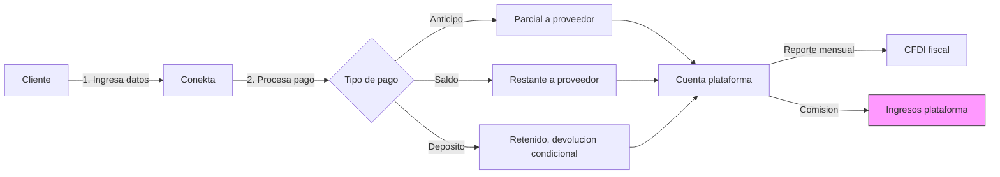

# Pagos y Comisiones

El sistema procesa todos los pagos vía Conekta en pesos mexicanos (MXN). La plataforma genera ingresos mediante comisión por transacción sumada al precio visible del cliente. Cada proveedor define su política de cobro y depósito de garantía.

→ Ver [→ vision_y_alcance.md#modelo-de-ingresos](vision_y_alcance.md#modelo-de-ingresos) para el modelo de ingresos general.
→ Ver [→ flujo_de_reserva.md](flujo_de_reserva.md) para el flujo que desencadena los pagos.

## Conekta — Procesamiento en MXN (Decisión 4)

El sistema **SHALL** procesar todos los pagos vía Conekta API en pesos mexicanos (MXN). No **SHALL** aceptar otras monedas en MVP. Conekta maneja la tokenización de tarjetas, el procesamiento y la liquidación.

**Caption**: Arquitectura de pagos Conekta — flujo de dinero desde cliente hasta cuenta del proveedor e ingresos de plataforma (Diagrama D6).

### Tipos de Pago

| Tipo | Descripción | Destino |
|------|-------------|---------|
| Anticipo | Pago parcial al confirmar reserva | Parcial a proveedor |
| Saldo | Pago restante antes/después del evento | Restante a proveedor |
| Depósito de garantía | Monto retenido como garantía | Retenido en plataforma |

## Comisión por Transacción (Decisión 2, Decisión 9)

La comisión de plataforma **SHALL** sumarse al precio del proveedor. El porcentaje es configurable por el administrador (→ ver [→ roles_y_permisos.md#administrador](roles_y_permisos.md#administrador)).

### Visibilidad Diferenciada (Decisión 9)

| Quién | Qué ve | Fórmula |
|-------|--------|---------|
| Cliente | "Renta + Impuestos" | Precio proveedor + comisión + impuestos (sin desglose de comisión) |
| Proveedor | Precio final con comisión | Precio base + comisión + impuestos |

> Ejemplo: Proveedor configura servicio en $5,000 MXN. Comisión 10%.
> - **Cliente ve**: Renta $5,500 + Impuestos $XXX = Total $X,XXX
> - **Proveedor ve**: Precio cliente $5,500 (incluye comisión 10%)

El cliente **NO SHALL** ver desglose de comisión. El proveedor **SHALL** ver el precio final completo y podrá ajustar su precio base en consecuencia.

### Ajustes Dinámicos de Precio y Comisión (Supuesto 3)

La comisión **SHALL** calcularse sobre el precio vigente de la reserva, incluyendo los ajustes dinámicos del proveedor (temporada, demanda, día de la semana — → ver [→ taxonomia_de_servicios.md#precios-dinámicos—capacidad-del-proveedor-supuesto-3](taxonomia_de_servicios.md#precios-dinámicos—capacidad-del-proveedor-supuesto-3)). El desglose para el cliente **SHALL** mostrar el precio vigente (base + ajuste dinámico) + impuestos, sin desglosar la comisión.

> Ejemplo: Precio base $5,000 MXN con ajuste dinámico de temporada +20% ($6,000). Comisión 10%: el cliente ve $6,600 + impuestos; el proveedor ve precio cliente $6,600 (incluye comisión 10%).

→ Ver [→ taxonomia_de_servicios.md#modelos-de-precio](taxonomia_de_servicios.md#modelos-de-precio) para configuración de precios por tipo de servicio.

## Cobro Flexible (Decisión 13)

Cada proveedor **SHALL** definir su política de cobro. El sistema soporta tres opciones que evitan que la plataforma se haga responsable de impago.

| Opción | Descripción | Responsabilidad plataforma |
|--------|-------------|---------------------------|
| Anticipo obligatorio | Monto configurable que el cliente paga al reservar | Procesa el anticipo |
| Pago completo pre-evento | 100% antes del evento | Procesa el pago completo |
| Cobro post-servicio | Cliente paga directamente al proveedor después del evento | **NO** retiene pagos |

### Anticipo Obligatorio

El proveedor configura un porcentaje o monto fijo como anticipo obligatorio. El saldo restante vence antes del evento según la política del proveedor.

| Escenario | Resultado |
|-----------|-----------|
| Proveedor configura anticipo 50% | Cliente paga 50% al reservar, saldo antes del evento |
| Proveedor configura anticipo $3,000 fijo | Cliente paga $3,000 al reservar |
| Cliente no paga saldo a tiempo | Notificación automática, reserva en riesgo |

### Pago Completo Pre-Evento

El cliente paga el 100% al momento de reserva. No hay saldo pendiente.

### Cobro Post-Servicio

El proveedor asume el riesgo de cobro directo. La plataforma **NO SHALL** hacerse responsable de impago cuando el proveedor elige esta opción.

→ Ver [→ cancelaciones_y_reembolsos.md](cancelaciones_y_reembolsos.md) para escenarios de reembolso según política de cobro.

## Depósito de Garantía (Decisión 10)

El depósito de garantía es un monto retenido temporalmente como garantía contra daños. Es configurable por cada salón y **SHALL** ser separable del anticipo.

| Aspecto | Valor |
|---------|-------|
| ¿Quién lo configura? | Cada salón de forma independiente |
| ¿Es obligatorio? | No — a discreción del salón |
| ¿Cuándo se cobra? | Junto con el anticipo, al confirmar reserva |
| ¿Cuándo se devuelve? | Después del evento, si no hay daños reportados |
| ¿Es reembolsable? | Sí, condicional a ausencia de daños |

### Orden de Aplicación en Cancelación (Supuesto 7)

Cuando un cliente cancela, el orden de aplicación de los pagos es:

1. **Anticipo** → no reembolsable (se queda con el proveedor)
2. **Depósito** → reembolsable según política del proveedor
3. **Pagos adicionales** → reembolsables

→ Ver [→ cancelaciones_y_reembolsos.md#cancelación-por-cliente](cancelaciones_y_reembolsos.md#cancelación-por-cliente) para detalle del orden de aplicación.

## Impuestos — Calculadora y Reporte (Decisión 14)

El sistema **SHALL** calcular impuestos automáticamente (IVA u otros aplicables) y sumarlos al precio visible. El sistema **SHALL** generar reporte mensual de impuestos para cada proveedor.

### Cálculo Automático

| Concepto | Descripción |
|----------|-------------|
| Base imponible | Precio del servicio + extras |
| Impuestos | IVA u otros impuestos aplicables calculados automáticamente |
| Total | Base imponible + impuestos |

### Reporte Mensual

Cada proveedor **SHALL** poder acceder a un reporte mensual con:

| Campo | Descripción |
|-------|-------------|
| Transacciones | Lista de reservas en el mes |
| Monto bruto | Suma de precios base |
| Impuestos cobrados | Desglose por transacción |
| Comisión plataforma | Total de comisiones cobradas |
| Neto a recibir | Monto final transferido |

### Desglose por Categoría

El reporte **SHALL** permitir filtrar por categoría de servicio:

| Categoría | Ejemplo |
|-----------|---------|
| Salones | Reserva de salón de eventos |
| Sonidos | Alquiler de equipo de sonido |
| Servicios | Contratación de bartenders, meseros |

→ Ver [→ taxonomia_de_servicios.md#modelos-de-precio](taxonomia_de_servicios.md#modelos-de-precio) para modelos de precio por categoría.

## Documentos Relacionados

| Documento | Relación |
|-----------|----------|
| `flujo_de_reserva.md` | Reserva → desencadena pago |
| `cancelaciones_y_reembolsos.md` | Cancelación → reembolso |
| `vision_y_alcance.md` | Modelo de ingresos → comisión |
| `taxonomia_de_servicios.md` | Configuración de precios por tipo |
| `roles_y_permisos.md` | Administrador configura comisión |
