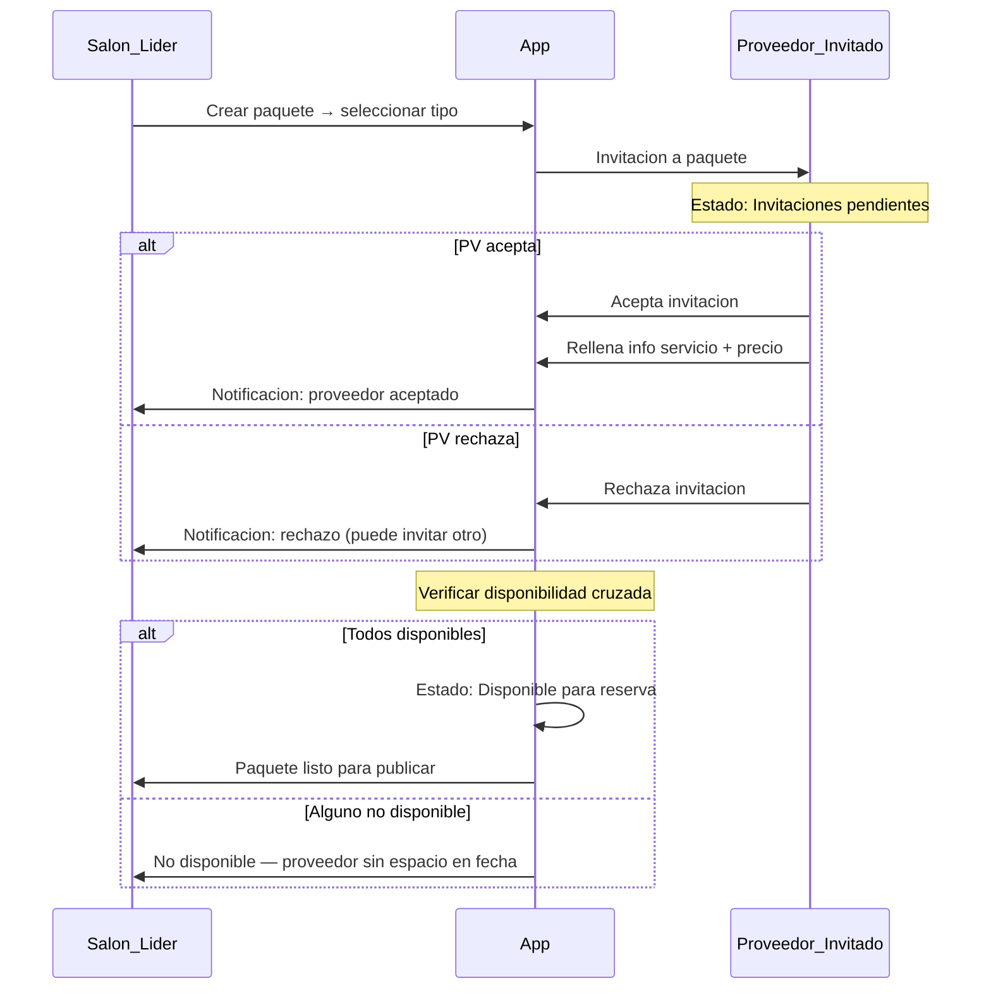
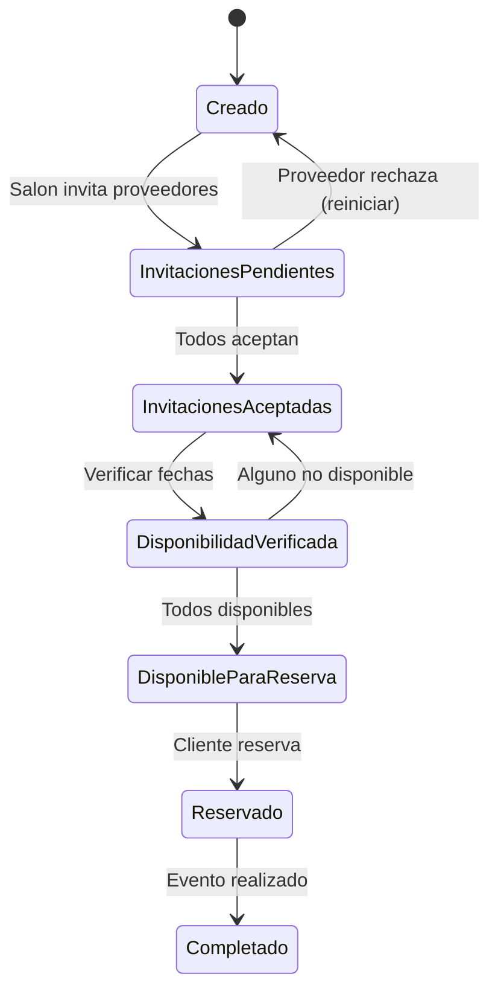

# Paquetes Colaborativos

Un **paquete colaborativo** es un conjunto de servicios de múltiples proveedores (salón + sonido + servicios) agrupados bajo una reserva conjunta con precio cerrado. Solo el salón puede crear y liderar paquetes; los demás proveedores son invitados que aceptan o rechazan.

→ Ver [→ vision_y_alcance.md#alcance-del-marketplace](vision_y_alcance.md#alcance-del-marketplace) para contexto del marketplace.
→ Ver [→ taxonomia_de_servicios.md#tipos-de-servicio](taxonomia_de_servicios.md#tipos-de-servicio) para tipos de servicio incluidos.

## Creación de Paquete por Líder (Decisión 6)

Solo los salones **SHALL** poder crear paquetes colaborativos. El salón líder **SHALL** invitar a otros proveedores (sonido, servicios-persona) para completar el paquete. Cada proveedor invitado **SHALL** aceptar y rellenar su información antes de que el paquete pueda publicarse.

| Rol | Permisos sobre el paquete |
|-----|---------------------------|
| Salón líder | Crear, invitar, eliminar, editar precio base, publicar |
| Proveedor invitado | Aceptar/rechazar, rellenar info, ajustar su precio |
| Cliente | Visualizar, reservar paquete completo |

> Ejemplo: Salón "Las Palmas" crea paquete con sonido y bartender. Invita a "SonidoPro" y "BartenderMX". Ambos aceptan y configuran su parte del paquete.

## Flujo de Invitaciones

El proceso de invitación sigue un flujo secuencial con verificación de disponibilidad al final.

**Caption**: Flujo de creación de paquete colaborativo con invitaciones y verificación de disponibilidad (Diagrama D2).

### Estados de Invitación

Cada invitación tiene un estado independiente:

| Estado | Descripción | Siguiente acción |
|--------|-------------|------------------|
| Pendiente | Invitación enviada, sin respuesta | Proveedor acepta o rechaza |
| Aceptada | Proveedor aceptó, info completada | Verificación de disponibilidad |
| Rechazada | Proveedor rechazó | Salón puede invitar otro proveedor |

Si un miembro rechaza, el salón **SHALL** poder invitar a otro proveedor del mismo tipo de servicio. El paquete **SHALL** permanecer en estado "Invitaciones pendientes" hasta que todos los miembros acepten.

## Disponibilidad Cruzada

El sistema **SHALL** verificar disponibilidad de todos los miembros del paquete para la fecha y horario solicitados. La verificación **SHALL** ejecutarse después de que todos los miembros acepten la invitación.

| Escenario | Resultado |
|-----------|-----------|
| Todos los miembros disponibles | Paquete en estado "Disponible para reserva" |
| Un miembro no disponible | Paquete en estado "Pendiente de disponibilidad" con mensaje indicando qué proveedor no tiene espacio |

→ Ver [→ taxonomia_de_servicios.md#concurrencia](taxonomia_de_servicios.md#concurrencia) para reglas de concurrencia por tipo de servicio.

## Precio del Paquete

El sistema **SHALL** sumar automáticamente los precios de todos los miembros del paquete. El precio final incluye: precio base de cada miembro + extras seleccionados + impuestos + tarifa de app.

| Componente | Quién lo define | Visible para cliente |
|------------|-----------------|---------------------|
| Precio base salón | Salón líder | Sí (en resumen) |
| Precio base sonido | Proveedor de sonido | Sí (en resumen) |
| Precio base servicio | Proveedor de servicio | Sí (en resumen) |
| Extras seleccionados | Cliente al reservar | Sí (desglosados) |
| Impuestos | Sistema (cálculo automático) | Sí |
| Tarifa de app | Sistema (comisión) | No — oculta para cliente |

→ Ver [→ pagos_y_comisiones.md#visibilidad-de-precios](pagos_y_comisiones.md#visibilidad-de-precios) para visibilidad diferenciada cliente vs proveedor.

## Estados del Paquete (Diagrama D8)

El paquete colaborativo tiene 7 estados que representan su ciclo de vida completo.

**Caption**: Diagrama de estados del paquete colaborativo — 7 estados desde creación hasta completado (Diagrama D8).

### Descripción de Estados

| Estado | Descripción | Transiciones posibles |
|--------|-------------|----------------------|
| Creado | Salón inició paquete, sin invitaciones | → Invitaciones pendientes |
| Invitaciones pendientes | Invitaciones enviadas, esperando respuesta | → Invitaciones aceptadas (todos aceptan), → Creado (rechazo) |
| Invitaciones aceptadas | Todos los miembros aceptaron | → Disponibilidad verificada |
| Disponibilidad verificada | Sistema verificó disponibilidad por slot (fecha + horario) de todos | → Disponible para reserva (todos OK), → Invitaciones aceptadas (conflicto) |
| Disponible para reserva | Paquete publicado y reservable | → Reservado |
| Reservado | Cliente completó reserva | → Completado |
| Completado | Evento realizado con éxito | Estado final |

→ Ver [→ flujo_de_reserva.md#estados-de-reserva](flujo_de_reserva.md#estados-de-reserva) para el flujo de reserva que sigue al estado "Disponible para reserva".

## Documentos Relacionados

| Documento | Relación |
|-----------|----------|
| `flujo_de_reserva.md` | Paquete → reserva (flujo siguiente) |
| `taxonomia_de_servicios.md` | Tipos de servicio en el paquete |
| `pagos_y_comisiones.md` | Cálculo de precio total del paquete |
| `cancelaciones_y_reembolsos.md` | Cancelación de paquete reservado |
| `roles_y_permisos.md` | Permisos de salón líder vs proveedor invitado |
