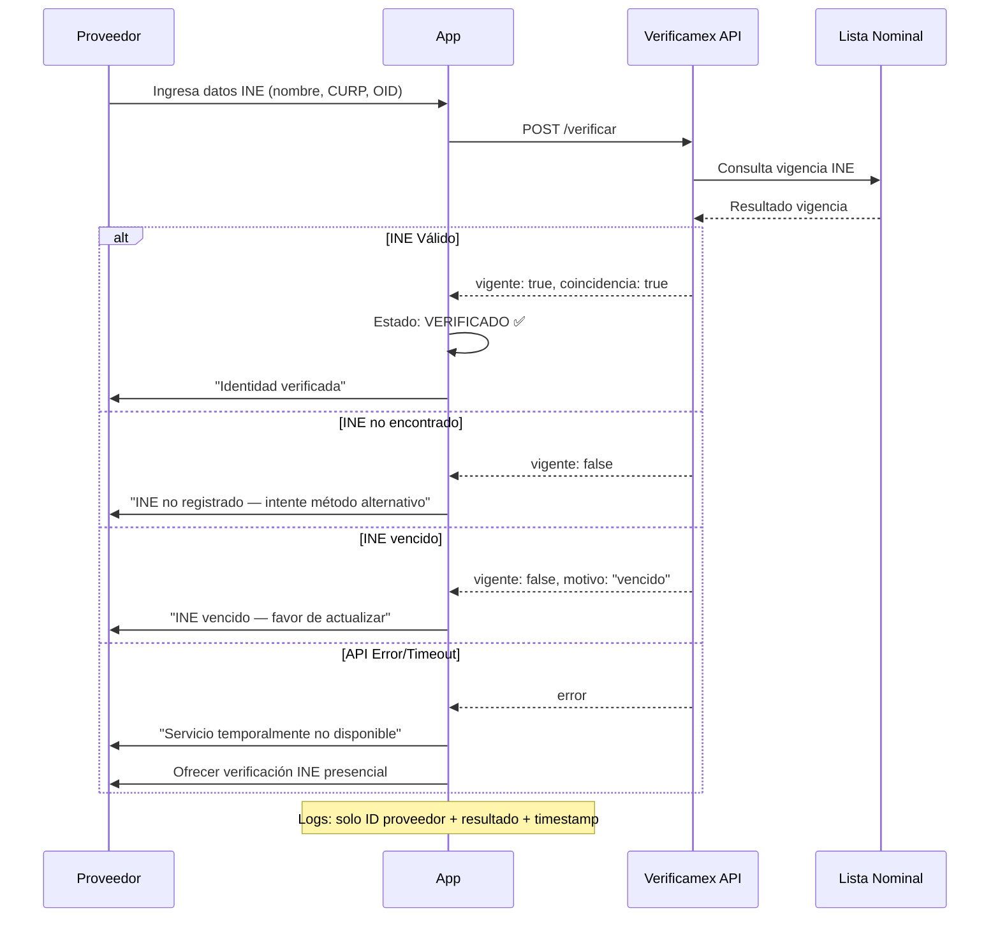

# Verificamex — Integración Técnica

Verificamex es un servicio de verificación de identidad que consulta la **Lista Nominal del INE** (Instituto Nacional Electoral) para confirmar la vigencia de credenciales de elector. La plataforma integra con Verificamex como opción principal de verificación KYC por su costo bajo y simplicidad de integración.

→ Ver [→ verificacion_de_identidad.md](verificacion_de_identidad.md) para contexto UX de verificación.
→ Ver [→ normativa_mexicana_2026.md](normativa_mexicana_2026.md) para LFPDPPP y cumplimiento legal.

## ¿Qué es Verificamex?

Verificamex es una API que permite verificar la vigencia de una credencial de INE contra la Lista Nominal oficial. La verificación valida: vigencia del INE, nombre completo del titular, CURP, y estatus en Lista Nominal (activo, vencido, no encontrado).

| Característica | Detalle |
|----------------|---------|
| Fuente de datos | Lista Nominal del INE (vía RENAPO) |
| Qué verifica | Vigencia de credencial, nombre, CURP, estatus |
| Tipo de consulta | REST API, HTTPS |
| Autenticación | API Key por cuenta |
| Costo | Por consulta (bajo comparado con Truora/Veriff) |

## Endpoints Conceptuales

> **Nota**: Los endpoints documentados son conceptuales. La implementación exacta debe verificarse con la documentación oficial de Verificamex al momento de la integración.

### Consulta de Vigencia de INE

| Campo | Descripción |
|-------|-------------|
| **Método** | `POST` |
| **Propósito** | Verificar si una credencial de INE está vigente en Lista Nominal |
| **Datos de entrada** | CURP, clave de elector (OID), nombre completo, OCR (opcional) |
| **Datos de salida** | vigente (true/false), coincidencia nombre, estatus, motivo (si aplica) |

### Campos de Request

| Campo | Tipo | Requerido | Descripción |
|-------|------|-----------|-------------|
| `curp` | string | Sí | CURP del titular de la credencial |
| `clave_elector` | string | Sí | Clave de elector (OID) de la credencial |
| `nombre_completo` | string | Sí | Nombre completo como aparece en la credencial |
| `ocr` | string | No | Código OCR de la credencial (mejora precisión) |

### Campos de Response

| Campo | Tipo | Descripción |
|-------|------|-------------|
| `vigente` | boolean | `true` si la credencial está vigente en Lista Nominal |
| `coincidencia_nombre` | boolean | `true` si el nombre coincide con el registro |
| `estatus` | string | Estatus en Lista Nominal: `activo`, `vencido`, `no_encontrado` |
| `motivo` | string | Motivo del rechazo (si aplica): `ine_vencido`, `ine_no_encontrado`, `datos_no_coinciden` |

### Autenticación

| Aspecto | Detalle |
|---------|---------|
| Método | API Key en header de autenticación |
| Header | `Authorization: Bearer {API_KEY}` |
| Rate limiting | Depende del plan contratado; verificar con Verificamex |
| Timeout recomendado | 10 segundos |

## Flujo de Verificación — Diagrama D7

**Caption**: Flujo de verificación Verificamex — consulta de INE contra Lista Nominal con manejo de casos exitosos y errores (Diagrama D7).

## Validación Lista Nominal

La consulta a Verificamex returna un resultado de la Lista Nominal del INE. Los posibles resultados son:

| Resultado | Significado | Acción del sistema |
|-----------|-------------|-------------------|
| **Vigente** | INE activo, nombre coincide | Marcar proveedor como VERIFICADO |
| **Vencido** | INE existe pero está vencido | Mostrar "INE vencido — favor de actualizar"; verificar pendiente |
| **No encontrado** | INE no registrado en Lista Nominal | Mostrar "INE no registrado — intente método alternativo" |
| **Datos no coinciden** | INE vigente pero nombre no coincide | Mostrar "Los datos no coinciden con la credencial"; reintentar |

### Escenarios de Validación

#### Escenario: Verificación exitosa

> DADO que un proveedor ingresa datos de INE completos y correctos
> CUANDO se consulta la API de Verificamex
> ENTONCES la respuesta **SHALL** confirmar vigencia y coincidencia de nombre
> Y el proveedor **SHALL** quedar verificado

#### Escenario: Verificación fallida — INE no encontrado

> DADO que un proveedor ingresa datos de INE
> CUANDO la API de Verificamex no encuentra el INE
> ENTONCES el sistema **SHALL** mostrar "INE no encontrado en Lista Nominal"
> Y el proveedor **SHALL** poder reintentar o elegir otro método

#### Escenario: Verificación fallida — INE vencido

> DADO que un proveedor ingresa datos de INE vencido
> CUANDO se consulta la API de Verificamex
> ENTONCES el sistema **SHALL** mostrar "INE vencido — favor de actualizar"
> Y la verificación **SHALL** quedar pendiente

## Manejo de Errores

| Error | Mensaje al usuario | Fallback | Acción sistema |
|-------|-------------------|----------|---------------|
| **Timeout** (>10s) | "Servicio temporalmente no disponible" | Ofrecer verificación INE presencial | Registrar error para monitoreo |
| **Error de servicio** (5xx) | "Error temporal — intente de nuevo" | Reintentar una vez; si falla, ofrecer alternativa | Registrar en logs de auditoría |
| **Datos inválidos** (4xx) | "Los datos ingresados no son válidos" | Corregir datos y reintentar | No registrar datos inválidos |
| **Rate limiting** | "Máximo de intentos alcanzado — espere un momento" | Esperar y reintentar o usar método alternativo | Registrar intento |
| **INE no encontrado** | "INE no registrado en Lista Nominal" | Reintentar con otros datos o método presencial | Registrar resultado |
| **INE vencido** | "INE vencido — favor de actualizar" | Actualizar INE y reintentar | Registrar resultado |
| **Datos no coinciden** | "Los datos no coinciden con la credencial" | Verificar datos y reintentar | Registrar intento |

### Escenario: Timeout de API

> DADO que la API de Verificamex tarda más de 10 segundos
> CUANDO se alcanza el timeout
> ENTONCES el sistema **SHALL** mostrar "Servicio temporalmente no disponible"
> Y **SHALL** ofrecer verificación alternativa

### Escenario: Rate limiting

> DADO que se alcanza el límite de consultas a la API
> CUANDO se intenta una nueva consulta
> ENTONCES el sistema **SHALL** mostrar "Máximo de intentos alcanzado"
> Y **SHALL** sugerir esperar o usar método alternativo

## Seguridad de Datos — LFPDPPP

El manejo de datos de identificación personal en la integración con Verificamex **SHALL** cumplir con la LFPDPPP.

| Principio | Implementación |
|-----------|---------------|
| **Minimización** | Solo se envían los datos estrictamente necesarios para la verificación |
| **No almacenamiento** | Los datos de INE (nombre, CURP, OCR) **NO SHALL** almacenarse permanentemente |
| **Logs seguros** | Los logs contienen **solo**: ID proveedor, resultado (éxito/fallo), timestamp |
| **Sin datos biométricos** | No se procesan ni almacenan datos biométricos en esta integración |
| **Consentimiento** | El usuario acepta el aviso de privacidad antes de iniciar verificación |
| **Retención** | Los datos se procesan en tiempo real y no se conservan después de la verificación |

### Qué SÍ se registra en logs

| Campo | Ejemplo |
|-------|---------|
| ID proveedor | `prov_abc123` |
| Resultado | `verificado`, `ine_vencido`, `ine_no_encontrado`, `error_api` |
| Timestamp | `2026-08-11T14:30:00Z` |
| Método usado | `verificamex` |

### Qué NO se registra en logs

| Dato | Razón |
|------|-------|
| Nombre completo | Datos personales protegidos por LFPDPPP |
| CURP | Dato personal identificable |
| Clave de elector | Dato sensible de identificación |
| OCR | Dato de la credencial |

→ Ver [→ normativa_mexicana_2026.md#ley-federal-de-protección-de-datos-personales-lfpdppp](normativa_mexicana_2026.md#ley-federal-de-protección-de-datos-personales-lfpdppp) para cumplimiento legal detallado.

## Comparación con Alternativas

| Criterio | Verificamex | Truora | Veriff |
|----------|-------------|--------|--------|
| **Verificación INE directa** | ✅ Lista Nominal | Parcial | Parcial |
| **Costo por verificación** | Bajo | Medio | Alto |
| **Complejidad integración** | Baja (1 endpoint) | Media (multi-endpoint) | Media (multi-endpoint) |
| **Disponibilidad México** | ✅ Nativa | ✅ | ✅ |
| **Documentación** | Básica | Buena | Buena |
| **Soporte técnico** | Limitado | Bueno | Bueno |
| **Biometría** | No | Sí (selfie + liveness) | Sí (selfie + liveness) |

### Decisión: Verificamex como Opción Principal

Verificamex **SHALL** ser la opción principal de verificación por:

1. **Costo bajo**: Consulta directa contra Lista Nominal sin intermediarios biométricos
2. **Simplicidad**: Un solo endpoint con datos de INE; sin flujo de selfie o liveness
3. **Cobertura nativa**: Verificación directa del INE mexicano, no genérica
4. **Velocidad**: Respuesta inmediata de la Lista Nominal

> Truora y Veriff **SHALL** mantenerse como alternativas para casos donde se requiera verificación biométrica (selfie + liveness) o cuando Verificamex no esté disponible.

## Checklist de Integración

- [ ] API Key de Verificamex configurada en variables de entorno
- [ ] Endpoint de verificación documentado con formato exacto de request/response
- [ ] Manejo de timeout (10 segundos) implementado
- [ ] Fallback a verificación INE presencial funcional
- [ ] Logs de auditoría registran solo metadatos (sin datos personales)
- [ ] Aviso de privacidad actualizado para incluir Verificamex
- [ ] Rate limiting configurado según plan contratado
- [ ] Escenarios de error cubiertos: timeout, 5xx, 4xx, rate limiting

## Documentos Relacionados

| Documento | Relación |
|-----------|----------|
| `verificacion_de_identidad.md` | Contexto UX y métodos de verificación |
| `normativa_mexicana_2026.md` | LFPDPPP — privacidad de datos de identificación |
| `roles_y_permisos.md` | Verificación como requisito de rol proveedor |
| `interfaces_proveedor.md` | Estado de verificación en panel del proveedor |
